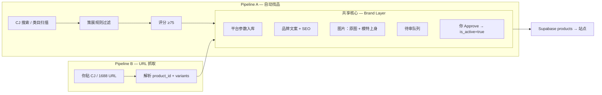

# AXIS / NEUTRAL 产品自动化流水线（双通道）

> 目标：平台参数可直用，**品牌层（名、文案、SEO、模特图）必须重写**。  
> 默认市场：Australia · 品牌人格：androgynous + alpha female（见 `BRAND_GUIDELINES.md`）。

---

## 0) 设计原则（一句话）

**供应链数据 = 真源 · 品牌表达 = 重写 · 图片 = CJ 真实 + AI 上身补叙事**

| 层级 | 来源 | 是否自动化 | 人工卡点 |
|------|------|------------|----------|
| 履约参数 | CJ / 平台 API | ✅ 直写 DB | 变体可下单、物流、国家 |
| 商业参数 | 成本 + 规则算价 | ✅ 半自动 | 毛利低于安全线 → 拒收 |
| 品牌文案 | LLM + 品牌手册 | ✅ 必重写 | 禁用词 / 语气抽检 |
| SEO | 规则 + AU 词库 | ✅ 必生成 | slug 唯一、关键词不堆砌 |
| 图片 | CJ 原图 + AI 上身 | ✅ 流水线 | **你拍板**是否可当 Hero / 首页 |

---

## 1) 两条入口（Pipeline）



### Pipeline A — 自动找品（Discovery）

**触发**：定时（如每日）或你一句「扫 CJ 黑西裤 AU 可发」。

**步骤**：

1. **搜索**：按 `catalogCuration.ts` + `BRAND_GUIDELINES.md` 关键词池  
   - 必含：`black` / `charcoal` / `slate` / `wide leg` / `blazer` / `cargo` 等  
   - 排除：Harajuku、plaid、camo、paint splatter、faux lambswool（见 `CATALOG_REMOVALS`）
2. **硬过滤**：单色中性、结构廓形、无亚文化 tag
3. **软评分**：`AXIS_NEUTRAL_product_eval.md`（≥75 进候选池）
4. **输出**：`docs/cj_candidate_shortlist.md` 同款表格 + `product_intake` 待审行（见 §6）

**适合**：扩品、补类目、测试新供应商。

### Pipeline B — URL 抓取（Intake）

**触发**：你提供 1 条或多条 URL（CJ 商品页、1688 详情页）。

**步骤**：

1. 解析 `cj_product_id` / 变体 `vid` / 主图 URL / 尺码表 / 供货价
2. 走与 A 相同的 **策展硬过滤**（不合格直接拒，不进 LLM）
3. 进入共享核心 Brand Layer
4. 回你一条 **上架预览包**（文案 + 图 + 建议 AUD 价）

**适合**：你看到具体款、竞品链接、工厂推款。

---

## 2) 平台参数（可直接用）

从 CJ / 平台 API 或抓取结果 **原样或轻度规范化** 写入 `products`：

| 字段 | 说明 |
|------|------|
| `cj_product_id` | 商品 ID |
| `cj_variant_id` | 默认售卖变体 vid |
| `cj_sku` | 可选 |
| `logistic_name` | 如 `CJPacket` |
| `from_country_code` | 默认 `CN`，按运费 API 校正 |
| `sizes` | 平台尺码 JSON → 统一为 `["XS","S",...]` 或数字腰围 |
| `images`（原始槽） | CJ 图 URL 数组，**slot 0–1 保留供应商真实图** |
| `price_aud` | 由成本 + 运费 + 目标毛利 **公式计算**（可覆盖） |

**不要直接用平台的**：`name`、`description`、标题里的 emoji、「韩版」「爆款」等词。

---

## 3) 品牌层（必须重写）

依据：`BRAND_GUIDELINES.md` · `content_guidelines.md` · `productCopy.ts` 范例。

### 3.1 商品名（`name`）

规则：

- 英文，2–6 词，**颜色 + 廓形 + 品类**（如 `Black Wide-Leg Cargo Trouser`）
- 禁止：supplier 原标题、全大写堆砌、Korean style、Hot sale
- 可选系列前缀：不加品牌名在 title 内（SEO 用 slug）

### 3.2 PDP 文案

| 字段 | 要求 |
|------|------|
| `description` | 1–2 句，轮廓 + 场景，无讨好词 |
| `story` | Fit note + 穿着意图（androgynous proportion / structured ease） |
| `details` | jsonb 数组，`Label · Value`（面料、腰头、裤型、洗护） |
| `category` | `OUTERWEAR` / `BOTTOMS` / `TOPS` / `FOOTWEAR` |
| `collection_slug` | 默认 `aw26`，全店 catalog 用 `all` |

### 3.3 SEO（每 SKU 生成）

当前 schema 无独立 `seo_title` 列时，先写入 **metadata 扩展** 或前端 `SeoHead` 消费字段（实施阶段二可加 migration）：

| 产出 | 规则 |
|------|------|
| `slug` | `black-wide-leg-cargo-trouser`（短、AU 可读、唯一） |
| `meta_title` | `{name} \| AXIS / NEUTRAL`（≤60 字符） |
| `meta_description` | 含 1 个主词 + 1 个长尾 + Melbourne/Australia（≤155 字符） |
| `og:image` | 优先 **模特上身图**，其次 CJ 主图 |
| `json_ld` | Product schema：brand、price AUD、availability |

**AU 关键词池**（轮换，每品 1 主 + 1 辅）：

- 主：`androgynous women's clothing australia` / `women's oversized blazer australia`
- 辅：`tomboy fashion australia`（长尾 only）/ `wide leg trousers australia`

### 3.4 定价（半自动）

```
price_aud >= (landed_cost_aud + payment_buffer + returns_buffer) / (1 - target_ad_spend)
```

- `landed_cost_aud` = 货价 + 直发 AU 运费（CJ 运费 API）
- `target_ad_spend` 建议 0.30–0.35
- 低于毛利安全线 → 状态 `rejected_margin`，不生成文案

---

## 4) 图片流水线（重点）

**固定 SOP（必做）**：[`product_image_set_workflow.md`](./product_image_set_workflow.md) — 每 SKU **7 张**（1 封面 + 1 白底 + 5 细节），上架前 `npm run check:product-images -- {slug}`。

参照 `ai_model_prompts.md` §8，**每 SKU 标准包**：

| 序号 | 类型 | 来源 | 用途 |
|------|------|------|------|
| PDP | 供应商真实 | CJ / 1688 URL | PDP gallery · 颜色/结构信任 |
| 07 | **模特封面** | AI Model B | 社媒首图、Lookbook、Hero 候选 |
| 01 | 白底平铺 | AI 或供应商 crop | 细节图真源 |
| 02–06 | 细节 macro ×5 | AI（引 01） | 链饰/扣/口袋/里布等 |

### 4.1 模特上身生成

输入：

- CJ 主图（服装区域）+ `ai_model_prompts.md` Model B prompt
- 品牌 negative prompt（禁 cute / girly / girl boss）

输出：

- `images[2]` = 电商全身 front（4:5 或 3:4）
- 可选：`images[3]` = 街景 9:16（TikTok）

### 4.2 首页 / Hero 升级（你强调的部分）

不是每个 SKU 都换 Hero，而是：

1. 新品模特图产出后跑 **Hero 候选评分**（构图、留白、字区可读、与 `OWN THE STREET` 调性）
2. 得分最高且你 **Approve** 的图 → 写入 `public/` 或 `src/assets/images/` + 更新 `Hero.tsx` / `hero` config（**需一次 git 部署**）
3. 其余 SKU 图仅进 PDP / 轮播，不自动覆盖全站 Hero

**建议**：每周最多换 1 次 Hero，避免品牌视觉漂移。

---

## 5) 人工卡点（必保留）

| 关卡 | 谁 | 动作 |
|------|-----|------|
| G1 策展 | 自动 | `catalogCuration` 规则 + 评分 &lt;75 拒绝 |
| G2 毛利 | 自动 | 低于安全线拒绝 |
| G3 文案 | 你或运营 | 抽检禁用词、fit 是否合理 |
| G4 图片 | **你** | 7 张图包齐全 + `check:product-images` + Approve 封面 / 是否 Hero |
| G5 上架 | 你一键 | `is_active=true`，加入 `CURATED_PRODUCT_SLUGS` |

未 Approve 前：`is_active=false`，站点不可见（或仅 preview 链接）。

---

## 6) 数据模型建议（待审队列）

实施 n8n / API 前，可增加表 `product_intake`（或 Supabase `metadata` 状态机）：

```text
status: discovered | intake | brand_draft | images_ready | approved | rejected
source: pipeline_a | pipeline_b
raw_payload: jsonb   -- 平台原始
brand_draft: jsonb   -- LLM 产出文案+SEO
image_manifest: jsonb -- URLs + slot roles
review_notes: text
```

通过后 **upsert** `public.products` 并同步 `src/data/productCopy.ts`（或仅 DB，站点读 Supabase）。

---

## 7) 自动化分工（Cursor vs n8n）

| 环节 | 推荐工具 |
|------|----------|
| A 搜索 / B 抓 URL | n8n（CJ API、HTTP、定时） |
| 策展硬规则 | 代码真源 `catalogCuration.ts`（n8n 调脚本或 REST） |
| 品牌文案 + SEO | Cursor Agent / OpenAI node（注入 BRAND_GUIDELINES 摘要） |
| 图片上身 | Krea API / 现有 `ai_model_prompts.md` 模板 |
| 写库 | Supabase service role |
| Hero 更换 | **人工 PR**（避免自动改生产 Hero） |

---

## 8) 你给 Agent 的最小输入

### Pipeline B（最常用）

```text
上架 1 款：
- URL: https://...
- 目标变体颜色: Black only
- 目标售价: 可选；不填则按 35% 广告占比反推
- 是否竞选 Hero: 是/否
```

### Pipeline A

```text
自动找品：
- 类目: wide-leg trouser / blazer
- 数量: 10 候选
- 最低评分: 75
- 输出: 短名单 md + 待审表
```

---

## 9) 产出物清单（每次跑完应有）

- [ ] `product_intake` 或短名单表格 1 份
- [ ] 每款：品牌 `name` + `description` + `story` + `details` + SEO 三件套
- [ ] 每款：供应商图入库 + **标准 7 张 AI 图包**（见 `product_image_set_workflow.md`）
- [ ] 每款：`npm run check:product-images -- {slug}` 通过
- [ ] 建议 `price_aud` + 毛利测算一行
- [ ] Approve 后：`products` 行 + 更新 `CURATED_PRODUCT_SLUGS` / `cj_product_copy_update.sql` 片段

---

## 10) 关联文档

| 文档 | 用途 |
|------|------|
| `upload_workflow_cj.md` | 手工/半自动上货（本流水线的前身） |
| `cj_candidate_shortlist.md` | 候选池记录 |
| `catalogCuration.ts` | 策展真源 |
| `productCopy.ts` | 文案范例 |
| `ai_model_prompts.md` | 模特图 prompt |
| `product_image_set_workflow.md` | **7 张图包 SOP（每 SKU 必做）** |
| `AXIS_NEUTRAL_product_eval.md` | 打分上架 |
| `BRAND_GUIDELINES.md` | 语气与关键词 |
| `hybrid_catalog_strategy.md` | Tier1/2/3 · Wishlist 闸门 |
| `sourcing_weekly_routine.md` | 每周找货时间盒 · 勿一次铺 20 款 |

---

## 11) 实施顺序（建议）

1. **Phase 1**：Pipeline B（URL → 文案 + 图包 → 你 Approve → 手动 SQL 上架）— 最快验证  
2. **Phase 2**：`product_intake` 表 + Supabase 写库 API  
3. **Phase 3**：Pipeline A 定时扫 CJ + 短名单  
4. **Phase 4**：Hero 候选工作流（仍人工 PR）

---

**下一步**：你贴 1 条 CJ URL，可按 Pipeline B 跑通首份「上架预览包」（文案 + SEO + 模特图 prompt），不写库直到你 Approve。
